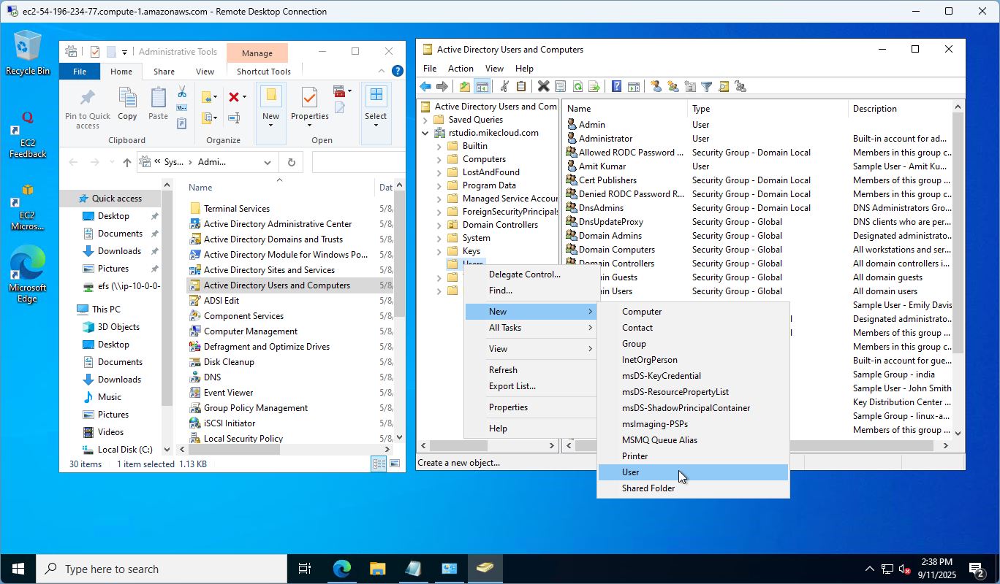

# AWS OpenClaw

This project deploys **OpenClaw** — an AI coding agent — on AWS, backed by **LiteLLM proxy** pointed at **AWS Bedrock** (Claude Sonnet). Users RDP into a MATE desktop and interact with OpenClaw through Chrome at `http://localhost:18789`.

No SSH keys. No open ports beyond RDP. All AWS access via IAM instance roles.



## Architecture

```
01-core/        VPC, subnets, NAT gateway
02-packer/      Packer AMI build (Ubuntu 24.04 → openclaw_mate_ami)
03-openclaw/    EC2 instance, IAM role, Secrets Manager
```

The Packer build produces a self-contained AMI with:
- MATE desktop + XRDP
- Google Chrome
- Cloud CLIs: AWS CLI v2, Azure CLI, Google Cloud SDK
- Dev tools: Git, Terraform, Packer, VS Code
- OpenClaw (AI coding agent)
- LiteLLM proxy (OpenAI-compatible gateway to Bedrock)

At boot, `userdata.sh` sets the `openclaw` user password from Secrets Manager, writes the Bedrock model config, and starts the `litellm` and `openclaw-gateway` systemd services.

## Prerequisites

- [AWS CLI](https://docs.aws.amazon.com/cli/latest/userguide/getting-started-install.html) configured with IAM credentials
- [Terraform](https://developer.hashicorp.com/terraform/install)
- [Packer](https://developer.hashicorp.com/packer/install)
- [jq](https://jqlang.github.io/jq/download/)
- Bedrock model access enabled in `us-east-1` for Claude Sonnet

## Build

```bash
./check_env.sh   # validate tools and AWS auth
./apply.sh       # deploy all three phases
```

`apply.sh` runs in order:
1. **Phase 1** — Terraform: VPC, subnets, NAT gateway
2. **Phase 2** — Packer: builds `openclaw_mate_ami` (~35–50 min)
3. **Phase 3** — Terraform: EC2 instance, IAM role, secrets

The Bedrock model ID is resolved dynamically at deploy time from the latest active versioned Claude Sonnet model.

## Connect

Get the password:

```bash
aws secretsmanager get-secret-value \
  --secret-id openclaw_credentials \
  --query SecretString --output text | jq -r '.password'
```

Get the public IP:

```bash
cd 03-openclaw && terraform output -raw public_ip
```

RDP to the public IP on port 3389 with username `openclaw`.

Open Chrome and navigate to `http://localhost:18789`.

## Clean Up

```bash
./destroy.sh
```

Destroys in reverse order: EC2 host → deregisters AMI + snapshot → core networking.
